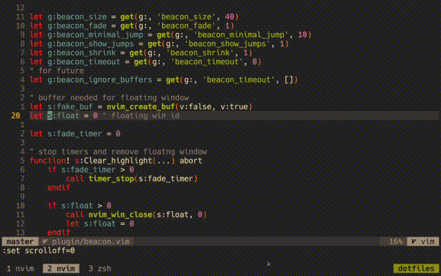

# Beacon.nvim - see your cursor jump
Whenever cursor jumps some distance or moves between windows, it will flash so you can see where it is. This plugin is heavily inspired by emacs package [beacon](https://github.com/Malabarba/beacon).

**Note**: required versions neovim v0.4+ or vim v8.2+. Working on support for older versions.



*(gif is too slow, it is actually quite fast animation)*

## Installation

### [vim-plug](https://github.com/junegunn/vim-plug)
1. Add the following configuration to your `.vimrc`.

        Plug 'danilamihailov/beacon.nvim'

2. Install with `:PlugInstall`.

Or use your favorite plugin manager

## Customization

### Disable beacon
Just set 
```viml
let g:beacon_enable = 0
```
and beacon will be disabled, but you still can use `:Beacon` command to highlight cursor. See [commands](#Commands).

### Changing color
Beacon is highlighted by `Beacon` group, so you can change it like this:
```viml
highlight Beacon guibg=white ctermbg=15
```
use `guibg` if you have `termguicolors` enabled, otherwise use `ctermbg`.

### Changing beacon size
```viml
let g:beacon_size = 40
```

### When to show beacon
If you **only** want to see beacon when cursor changes windows, you can set
```viml
let g:beacon_show_jumps = 0
```
and it will ignore jumps inside buffer. By default shows all jumps.

You can change what beacon considers significant jump, by changing
```viml
let g:beacon_minimal_jump = 10
```

### Animation
You can disable shrinking animation by setting
```viml
let g:beacon_shrink = 0
```
enabled by default

You can disable fading animation by setting (neovim only)
```viml
let g:beacon_fade = 0
```
enabled by default. 

You can set `g:beacon_timeout` to hide beacon early, by default it set to 500ms.

### Ignoring buffers
To ignore a buffer you can set list of regexes
```viml
g:beacon_ignore_buffers = [\w*git*\w]
```

## Commands
There is 4 commands available.
- `:Beacon` highlight current position (even if plugin is disabled)
- `:BeaconToggle` toggle `g:beacon_enable` variable
- `:BeaconOn` enable Beacon
- `:BeaconOff` disable Beacon

## Tips
If you want cursor to be highlighted when you jump to searches with `n`/`N` regardless of distance, use this mappings
```
nmap n n:Beacon<cr>
nmap N N:Beacon<cr>
nmap * *:Beacon<cr>
nmap # #:Beacon<cr>
```

Hide cursor line on inactive windows
```
augroup MyCursorLineGroup
    autocmd!
    au WinEnter * setlocal cursorline
    au WinLeave * setlocal nocursorline
augroup end
```

## Similar plugins
- Locate cursor after search https://github.com/inside/vim-search-pulse

## How it works
Whenever plugin detects some kind of a jump, it's showing floating window at the cursor position and using `winblend` fades window out.
